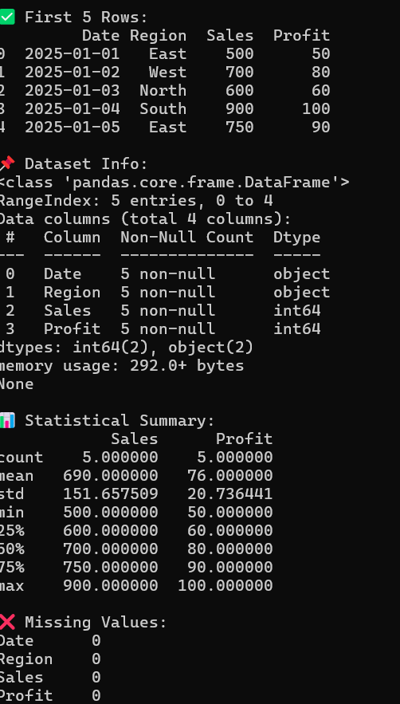
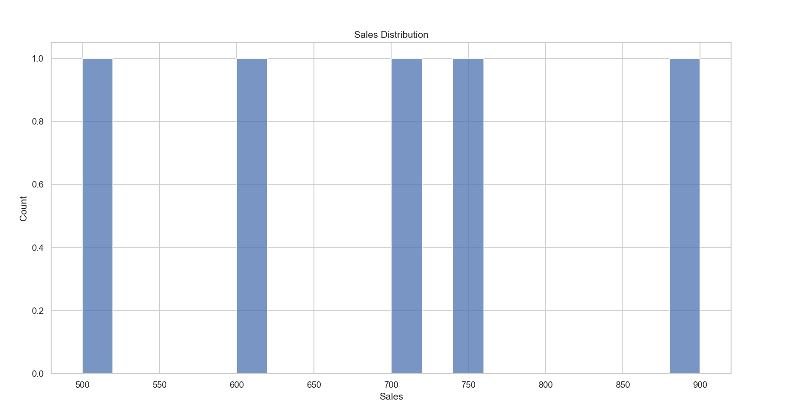

# Data Cleaning & Visualization Project

## Project Overview
This project focuses on cleaning, preprocessing, and visualizing raw sales data using Python. The main objective is to transform unstructured or inconsistent data into meaningful insights through data analysis and visualization techniques.

The project demonstrates important steps in the data analysis process, including handling missing values, removing duplicates, detecting outliers, and generating visual reports using graphs and charts.

---

## Objectives
- Clean and preprocess raw data
- Handle missing values and duplicate records
- Detect and remove outliers using statistical methods
- Analyze data using summary statistics
- Create visualizations to identify trends and patterns
- Generate a cleaned dataset for further analysis

## Technologies Used
- Python
- Pandas
- NumPy
- Matplotlib
- Seaborn

## Key Features

### 1. Data Loading
- Reads dataset from a CSV file using Pandas
- Displays dataset structure and sample records

### 2. Data Cleaning
- Handles missing values using mean and mode methods
- Removes duplicate rows
- Detects and removes outliers using the IQR method
- Converts date columns into proper datetime format

### 3. Data Analysis
- Generates statistical summaries
- Identifies relationships between columns
- Performs correlation analysis

### 4. Data Visualization
The project creates multiple visual reports including:
- Sales Distribution Histogram
- Sales by Region Bar Chart
- Sales Trend Over Time Line Graph
- Correlation Heatmap

### 5. Export Cleaned Data
- Saves processed data into a new CSV file named:
  `cleaned_sales_data.csv`

## Project Structure

```text
sales-data-analysis/
│
├── sales_data.py
├── sales_data.csv
├── cleaned_sales_data.csv
└── README.md
#Install required Python libraries using:
pip install pandas numpy matplotlib seaborn
#Open terminal in the project folder and run:
python sales_data.py
#Expected Outcome
-Understand data preprocessing techniques
-Learn exploratory data analysis (EDA)
-Improve data visualization skills
-Gain experience working with real-world datasets
-Learn storytelling with data using charts and reports
#Learning Outcomes:
-Data cleaning and preprocessing
-Handling missing values and outliers
-Exploratory Data Analysis (EDA)
-Data visualization using Python libraries
-Generating business insights from raw data
## Output Screenshots

### Sales Distribution


### Sales Trend Over Time

